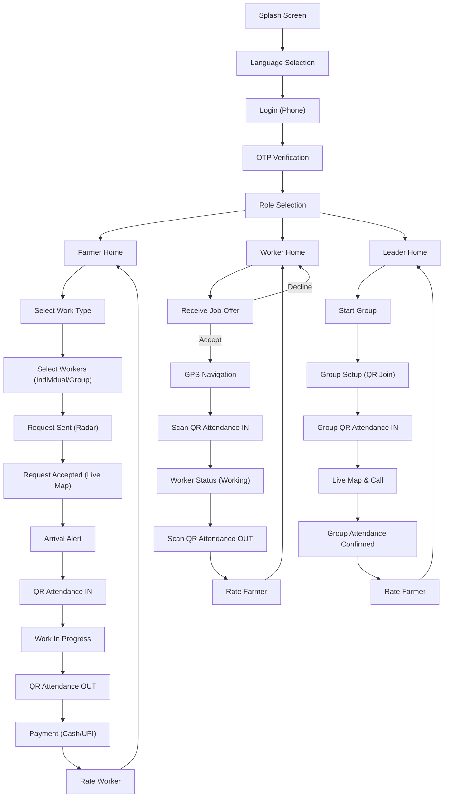
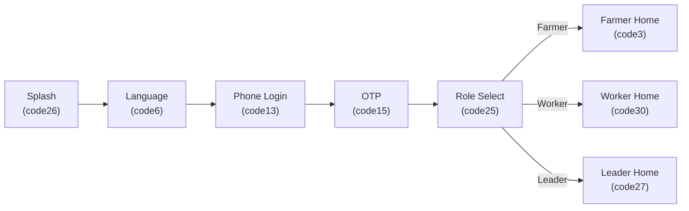
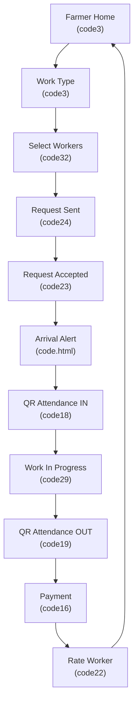
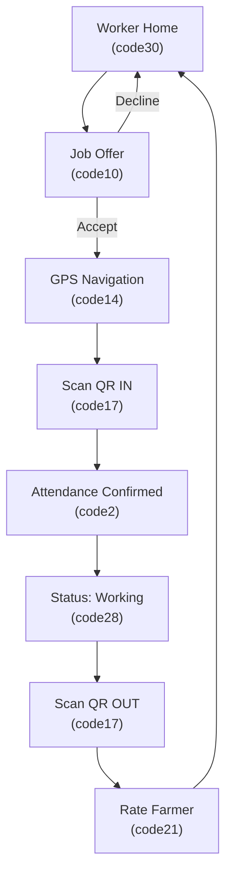
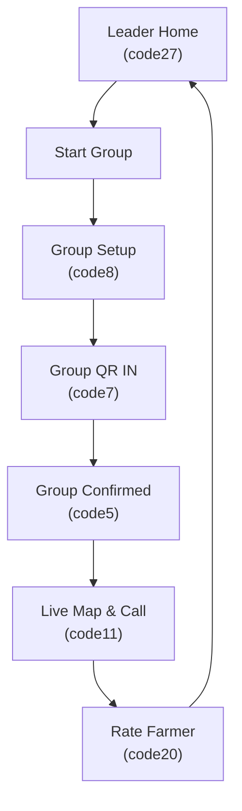

# 🗺️ FarmConnect — App Flow & Mock File Mapping

## 1. High-Level App Flow

---

## 2. Onboarding Flow

---

## 3. Farmer Job Lifecycle

---

## 4. Worker Job Lifecycle

---

## 5. Group Leader Workflow

---

## 6. Mock File → Screen Mapping

| File | Screen Title | Role | Category |
|------|-------------|------|----------|
| `code26.html` | Splash / Loading | All | Onboarding |
| `code6.html` | Language Selection | All | Onboarding |
| `code13.html` | Login (Phone + Custom Keypad) | All | Auth |
| `code15.html` | OTP Verification | All | Auth |
| `code25.html` | Role Selection | All | Onboarding |
| `code3.html` | Farmer Home (Work Type Grid) | Farmer | Home |
| `code4.html` | Farmer Profile Details | Farmer | Profile |
| `code32.html` | Worker Type & Count Selection | Farmer | Job Posting |
| `code24.html` | Request Sent (Radar Animation) | Farmer | Job Posting |
| `code23.html` | Request Accepted (Live Map) | Farmer | Job Status |
| `code.html` / `code1.html` | Arrival Alert (Worker Arrived) | Farmer | Job Status |
| `code18.html` | QR Display — Attendance IN | Farmer | Attendance |
| `code29.html` | Work In Progress (Timer + Map) | Farmer | Active Work |
| `code19.html` | QR Display — Attendance OUT | Farmer | Attendance |
| `code16.html` | Payment (Cash / UPI + QR) | Farmer | Payment |
| `code22.html` | Rate Worker (Emoji + Stars) | Farmer | Rating |
| `code30.html` | Worker Home (Start Work) | Worker | Home |
| `code31.html` | Worker Profile (Skills + Animals) | Worker | Profile |
| `code28.html` | Worker Status (Available/Working/Break) | Worker | Status |
| `code10.html` | Job Offer (Accept / Decline) | Worker | Job Offer |
| `code14.html` | GPS Navigation to Farmer | Worker | Navigation |
| `code17.html` | QR Camera Scanner | Worker | Attendance |
| `code2.html` | Attendance Confirmed | Worker | Attendance |
| `code21.html` | Rate Farmer (Telugu Emoji) | Worker | Rating |
| `code27.html` | Leader Home (Start Group) | Leader | Home |
| `code8.html` | Group Setup (QR Join + Members) | Leader | Group Mgmt |
| `code7.html` | Group QR Attendance IN | Leader | Attendance |
| `code5.html` | Group Attendance Confirmed | Leader | Attendance |
| `code9.html` | Group QR Attendance IN (alt) | Leader | Attendance |
| `code11.html` | Live Map & Call (Group Tracking) | Leader | Tracking |
| `code12.html` | Live Map Discovery (Find Workers) | All | Discovery |
| `code20.html` | Rate Farmer (Group Leader View) | Leader | Rating |
| `login-demo.html` | Demo Login Page (Dev Testing) | Dev | Testing |

---

## 7. Bottom Navigation Tabs by Role

| Role | Tab 1 | Tab 2 | Tab 3 | Tab 4 |
|------|-------|-------|-------|-------|
| **Farmer** | Home | Jobs | Group | Profile |
| **Worker** | Home | Tasks/History | Alerts | Profile |
| **Leader** | Home | History | — | Profile |
