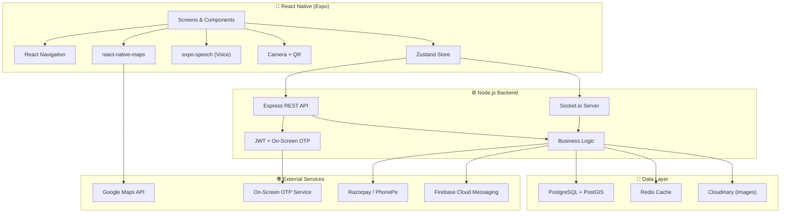
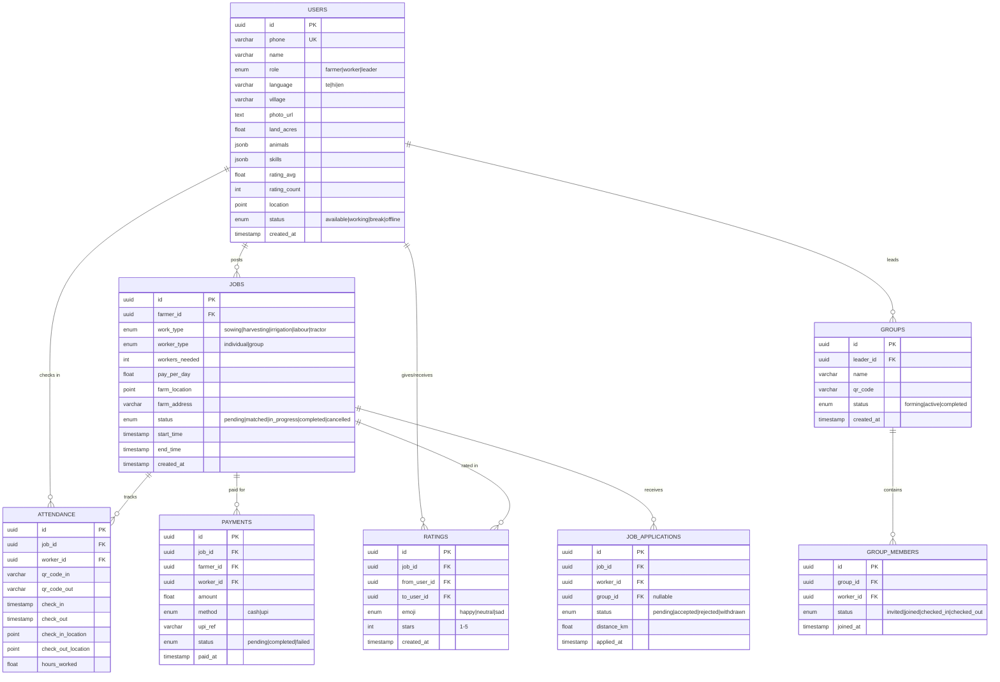

# 🏗️ FarmConnect — System Architecture

## 1. Architecture Overview



---

## 2. Project Structure

```
farmconnect/
├── mobile/                          # React Native (Expo)
│   ├── app.json
│   ├── src/
│   │   ├── navigation/
│   │   │   ├── AppNavigator.js      # Auth gate + role router
│   │   │   ├── FarmerNavigator.js
│   │   │   ├── WorkerNavigator.js
│   │   │   └── LeaderNavigator.js
│   │   ├── screens/
│   │   │   ├── auth/
│   │   │   │   ├── SplashScreen.js
│   │   │   │   ├── LanguageScreen.js
│   │   │   │   ├── LoginScreen.js
│   │   │   │   ├── OTPScreen.js
│   │   │   │   └── RoleSelectionScreen.js
│   │   │   ├── farmer/
│   │   │   │   ├── FarmerHomeScreen.js
│   │   │   │   ├── FarmerProfileScreen.js
│   │   │   │   ├── SelectWorkersScreen.js
│   │   │   │   ├── RequestSentScreen.js
│   │   │   │   ├── RequestAcceptedScreen.js
│   │   │   │   ├── ArrivalAlertScreen.js
│   │   │   │   ├── QRAttendanceINScreen.js
│   │   │   │   ├── WorkInProgressScreen.js
│   │   │   │   ├── QRAttendanceOUTScreen.js
│   │   │   │   ├── PaymentScreen.js
│   │   │   │   └── RateWorkerScreen.js
│   │   │   ├── worker/
│   │   │   │   ├── WorkerHomeScreen.js
│   │   │   │   ├── WorkerProfileScreen.js
│   │   │   │   ├── WorkerStatusScreen.js
│   │   │   │   ├── JobOfferScreen.js
│   │   │   │   ├── NavigationScreen.js
│   │   │   │   ├── QRScannerScreen.js
│   │   │   │   ├── AttendanceConfirmedScreen.js
│   │   │   │   └── RateFarmerScreen.js
│   │   │   └── leader/
│   │   │       ├── LeaderHomeScreen.js
│   │   │       ├── GroupSetupScreen.js
│   │   │       ├── GroupQRScreen.js
│   │   │       ├── GroupConfirmedScreen.js
│   │   │       ├── LiveMapScreen.js
│   │   │       └── RateFarmerScreen.js
│   │   ├── components/
│   │   │   ├── VoiceButton.js
│   │   │   ├── BottomNav.js
│   │   │   ├── EmojiRating.js
│   │   │   ├── StarRating.js
│   │   │   ├── CustomKeypad.js
│   │   │   ├── QRCodeDisplay.js
│   │   │   ├── QRScanner.js
│   │   │   ├── LiveTimer.js
│   │   │   ├── MassiveButton.js
│   │   │   └── MapView.js
│   │   ├── store/
│   │   │   ├── authStore.js
│   │   │   ├── jobStore.js
│   │   │   ├── locationStore.js
│   │   │   └── groupStore.js
│   │   ├── services/
│   │   │   ├── api.js
│   │   │   ├── socket.js
│   │   │   └── voice.js
│   │   ├── i18n/
│   │   │   ├── te.json              # Telugu
│   │   │   ├── hi.json              # Hindi
│   │   │   └── en.json              # English
│   │   └── theme/
│   │       ├── colors.js
│   │       ├── typography.js
│   │       └── spacing.js
│   └── package.json
│
├── backend/
│   ├── src/
│   │   ├── server.js                # Entry point
│   │   ├── config/
│   │   │   ├── database.js
│   │   │   ├── redis.js
│   │   │   └── env.js
│   │   ├── middleware/
│   │   │   ├── auth.js
│   │   │   ├── validate.js
│   │   │   ├── rateLimiter.js
│   │   │   └── errorHandler.js
│   │   ├── routes/
│   │   │   ├── auth.routes.js
│   │   │   ├── user.routes.js
│   │   │   ├── job.routes.js
│   │   │   ├── attendance.routes.js
│   │   │   ├── payment.routes.js
│   │   │   ├── rating.routes.js
│   │   │   ├── group.routes.js
│   │   │   └── location.routes.js
│   │   ├── controllers/
│   │   │   └── (mirrors routes)
│   │   ├── services/
│   │   │   ├── otp.service.js
│   │   │   ├── matching.service.js
│   │   │   ├── qr.service.js
│   │   │   ├── payment.service.js
│   │   │   └── notification.service.js
│   │   ├── models/                  # Prisma schema
│   │   └── socket/
│   │       ├── index.js
│   │       └── handlers/
│   │           ├── location.handler.js
│   │           └── job.handler.js
│   ├── prisma/
│   │   ├── schema.prisma
│   │   └── seed.js
│   ├── Dockerfile
│   └── package.json
│
├── docker-compose.yml
└── README.md
```

---

## 3. Database Schema



---

## 4. REST API Endpoints

### Auth
| Method | Path | Description |
|--------|------|-------------|
| POST | `/api/auth/send-otp` | Send OTP to phone |
| POST | `/api/auth/verify-otp` | Verify OTP, return JWT |
| POST | `/api/auth/set-role` | Set user role after first login |
| GET | `/api/auth/me` | Get current user profile |

### Users
| Method | Path | Description |
|--------|------|-------------|
| PUT | `/api/users/profile` | Update profile (name, photo, skills, animals) |
| PUT | `/api/users/language` | Set preferred language |
| PUT | `/api/users/status` | Set availability status |
| PUT | `/api/users/location` | Update GPS location |

### Jobs
| Method | Path | Description |
|--------|------|-------------|
| POST | `/api/jobs` | Create job request |
| GET | `/api/jobs/nearby` | Find nearby jobs (worker) |
| GET | `/api/jobs/:id` | Get job details |
| PUT | `/api/jobs/:id/cancel` | Cancel job request |
| POST | `/api/jobs/:id/apply` | Apply/accept job |
| PUT | `/api/jobs/:id/status` | Update job status |

### Attendance
| Method | Path | Description |
|--------|------|-------------|
| POST | `/api/attendance/generate-qr` | Generate QR for check-in/out |
| POST | `/api/attendance/scan` | Scan QR to record attendance |
| GET | `/api/attendance/job/:jobId` | Get attendance for a job |

### Payments
| Method | Path | Description |
|--------|------|-------------|
| POST | `/api/payments` | Record cash payment |
| POST | `/api/payments/upi` | Generate UPI QR |
| PUT | `/api/payments/:id/confirm` | Confirm payment received |

### Ratings
| Method | Path | Description |
|--------|------|-------------|
| POST | `/api/ratings` | Submit rating (emoji + stars) |
| GET | `/api/ratings/user/:userId` | Get user's ratings |

### Groups
| Method | Path | Description |
|--------|------|-------------|
| POST | `/api/groups` | Create group |
| POST | `/api/groups/:id/join` | Join via QR code |
| DELETE | `/api/groups/:id/members/:memberId` | Remove member |
| GET | `/api/groups/:id/members` | Get member list & status |

---

## 5. Socket.io Events

| Event | Direction | Payload | Purpose |
|-------|-----------|---------|---------|
| `location:update` | Client → Server | `{lat, lng}` | Worker sends GPS updates |
| `location:broadcast` | Server → Client | `{userId, lat, lng}` | Farmer sees worker on map |
| `job:new-offer` | Server → Client | `{job}` | Push job offer to nearby workers |
| `job:accepted` | Server → Client | `{worker, eta}` | Notify farmer of acceptance |
| `job:arrived` | Server → Client | `{worker}` | Worker arrival alert |
| `group:member-joined` | Server → Client | `{member}` | Notify leader of new member |
| `attendance:checked-in` | Server → Client | `{worker}` | Confirm QR scan success |

---

## 6. Security Model

| Layer | Implementation |
|-------|---------------|
| **Auth** | Phone + On-Screen OTP → JWT (access 15m + refresh 30d) |
| **Transport** | HTTPS everywhere, WSS for sockets |
| **API** | Rate limiting (100 req/min), request validation |
| **Data** | Encrypted at rest (PostgreSQL), no PII in logs |
| **Payments** | Server-side UPI QR generation, no card data stored |
| **Location** | Geo-fence validation for attendance (within 100m of farm) |
| **QR Codes** | Time-limited tokens (5-min expiry), single-use |

---

## 7. Offline-First Strategy

| Scenario | Solution |
|----------|----------|
| No network during QR scan | Cache QR data locally, sync when online |
| GPS navigation offline | Download tile cache for farm area |
| Profile edits offline | Queue mutations in AsyncStorage, sync on reconnect |
| Lost connection mid-work | Timer continues locally, syncs duration on reconnect |
