```mermaid
flowchart LR
    subgraph FE["📄 frontend/ (HTML Mocks)"]
        M["Design Reference\n34 screens"]
    end
    subgraph MB["📱 mobile/ (React Native)"]
        S["Screens + Components"]
        ST["Zustand Store"]
        API["Axios API Client"]
        SK["Socket.io Client"]
    end
    subgraph BE["⚙️ backend/ (Express)"]
        R["REST Routes"]
        C["Controllers"]
        WS["Socket.io Server"]
        PR["Prisma ORM"]
    end
    subgraph DB["💾 Database"]
        PG["PostgreSQL"]
    end

    M -->|"design copied to"| S
    S --> ST
    ST --> API
    ST --> SK
    API -->|"HTTP"| R
    SK -->|"WebSocket"| WS
    R --> C
    C --> PR
    WS --> PR
    PR --> PG
```

# 🔗 FarmConnect — Frontend ↔ Backend ↔ Mobile Connection Map

## Project Structure

```
edhigo_pani/
├── frontend/     📄 34 HTML mock screens (design reference)
├── backend/      ⚙️ Express + Prisma API (business logic)
└── mobile/       📱 React Native Expo (production app)
```



---

## Phase 1: Onboarding — Connection Details

```mermaid
flowchart TD
    subgraph HTML["📄 HTML Mocks"]
        H1["splash-screen.html"]
        H2["language-selection.html"]
        H3["login-phone-entry.html"]
        H4["otp-verification.html"]
        H5["role-selection.html"]
    end

    subgraph RN["📱 Mobile Screens"]
        S1["SplashScreen.js"]
        S2["LanguageScreen.js"]
        S3["LoginScreen.js"]
        S4["OTPScreen.js"]
        S5["RoleSelectionScreen.js"]
    end

    subgraph API["⚙️ Backend API"]
        A1["—"]
        A2["—"]
        A3["POST /auth/send-otp"]
        A4["POST /auth/verify-otp"]
        A5["POST /auth/set-role"]
    end

    subgraph DB["💾 DB Tables"]
        D1["—"]
        D2["—"]
        D3["users (otp, otpExpiresAt)"]
        D4["users (clear otp, return JWT)"]
        D5["users (role)"]
    end

    H1 -.->|design| S1
    H2 -.->|design| S2
    H3 -.->|design| S3
    H4 -.->|design| S4
    H5 -.->|design| S5

    S3 -->|calls| A3
    S4 -->|calls| A4
    S5 -->|calls| A5

    A3 -->|writes| D3
    A4 -->|reads/writes| D4
    A5 -->|writes| D5
```



---

## Screen-by-Screen Connection Table

### Phase 1: Onboarding

| # | HTML Mock | → Mobile Screen | → Backend API | → DB Table |
|---|-----------|----------------|---------------|------------|
| 1 | `splash-screen.html` | `SplashScreen.js` | None | — |
| 2 | `language-selection.html` | `LanguageScreen.js` | None (local store) | — |
| 3 | `login-phone-entry.html` | `LoginScreen.js` | `POST /auth/send-otp` | `users` |
| 4 | `otp-verification.html` | `OTPScreen.js` | `POST /auth/verify-otp` | `users` |
| 5 | `role-selection.html` | `RoleSelectionScreen.js` | `POST /auth/set-role` | `users` |

### Phase 2: Farmer Screens

| # | HTML Mock | → Mobile Screen | → Backend API | → DB Table |
|---|-----------|----------------|---------------|------------|
| 6 | `farmer-home-work-type.html` | `FarmerHomeScreen.js` | `GET /auth/me` | `users` |
| 7 | `farmer-profile.html` | `FarmerProfileScreen.js` | `PUT /users/profile` | `users` |
| 8 | `worker-type-count.html` | `SelectWorkersScreen.js` | `POST /jobs` | `jobs` |
| 9 | `request-sent.html` | `RequestSentScreen.js` | Socket `job:new-offer` | `jobs` |
| 10 | `request-accepted.html` | `RequestAcceptedScreen.js` | Socket `job:accepted` | `job_applications` |
| 11 | `arrival-alert-farmer.html` | `ArrivalAlertScreen.js` | Socket `job:arrived` | — |
| 12 | `qr-display-attendance-in.html` | `QRAttendanceINScreen.js` | `POST /attendance/generate-qr` | `attendances` |
| 13 | `work-in-progress-farmer.html` | `WorkInProgressScreen.js` | `PUT /jobs/:id/status` | `jobs`, `attendances` |
| 14 | `qr-display-attendance-out.html` | `QRAttendanceOUTScreen.js` | `POST /attendance/generate-qr` | `attendances` |
| 15 | `payment-farmer.html` | `PaymentScreen.js` | `POST /payments` | `payments` |
| 16 | `rate-worker-farmer.html` | `RateWorkerScreen.js` | `POST /ratings` | `ratings`, `users` |

### Phase 3: Worker Screens

| # | HTML Mock | → Mobile Screen | → Backend API | → DB Table |
|---|-----------|----------------|---------------|------------|
| 17 | `worker-home.html` | `WorkerHomeScreen.js` | `PUT /users/status` | `users` |
| 18 | `worker-profile.html` | `WorkerProfileScreen.js` | `PUT /users/profile` | `users` |
| 19 | `worker-status.html` | `WorkerStatusScreen.js` | `PUT /users/status` | `users` |
| 20 | `job-offer-group.html` | `JobOfferScreen.js` | `POST /jobs/:id/apply` | `job_applications` |
| 21 | `navigation-worker.html` | `NavigationScreen.js` | Socket `location:update` | — |
| 22 | `qr-scan-attendance.html` | `QRScannerScreen.js` | `POST /attendance/scan` | `attendances` |
| 23 | `attendance-confirmed.html` | `AttendanceConfirmedScreen.js` | None (UI only) | — |
| 24 | `rate-farmer-worker.html` | `RateFarmerScreen.js` | `POST /ratings` | `ratings`, `users` |

### Phase 4: Leader Screens

| # | HTML Mock | → Mobile Screen | → Backend API | → DB Table |
|---|-----------|----------------|---------------|------------|
| 25 | `leader-home-start-group.html` | `LeaderHomeScreen.js` | `POST /groups` | `groups` |
| 26 | `group-setup-leader.html` | `GroupSetupScreen.js` | `POST /groups/:id/join` | `group_members` |
| 27 | `group-qr-attendance-in.html` | `GroupQRScreen.js` | `POST /attendance/generate-qr` | `attendances` |
| 28 | `group-attendance-confirmed.html` | `GroupConfirmedScreen.js` | None (UI only) | — |
| 29 | `live-map-call-leader.html` | `LiveMapScreen.js` | Socket `location:broadcast` | — |
| 30 | `rate-farmer-leader.html` | `RateFarmerScreen.js` | `POST /ratings` | `ratings`, `users` |

### Phase 5: Shared

| # | HTML Mock | → Mobile Screen | → Backend API | → DB Table |
|---|-----------|----------------|---------------|------------|
| 31 | `live-map-discovery.html` | `LiveMapDiscoveryScreen.js` | `GET /jobs/nearby` | `jobs`, `users` |

---

## Data Flow Example: Farmer Posts a Job

```mermaid
sequenceDiagram
    participant HTML as 📄 farmer-home-work-type.html
    participant RN as 📱 FarmerHomeScreen.js
    participant Store as 🗄️ Zustand jobStore
    participant API as ⚙️ POST /api/jobs
    participant Ctrl as auth.controller.js
    participant DB as 💾 PostgreSQL (jobs)
    participant Socket as 📡 Socket.io
    participant Worker as 📱 WorkerHomeScreen.js

    HTML-->>RN: Design reference
    RN->>Store: selectWorkType('harvesting')
    RN->>RN: Navigate → SelectWorkersScreen
    RN->>Store: createJob({type, count, pay})
    Store->>API: POST /api/jobs {body}
    API->>Ctrl: validate + process
    Ctrl->>DB: prisma.job.create()
    DB-->>Ctrl: job record
    Ctrl->>Socket: emit('job:new-offer', job)
    Socket-->>Worker: Nearby workers receive offer
    Ctrl-->>Store: { job }
    Store-->>RN: Navigate → RequestSentScreen
```


