# 🔄 FarmConnect — Complete Data Flow

## 1. Authentication Flow

```mermaid
sequenceDiagram
    participant User as 👤 User (Any Role)
    participant App as 📱 Mobile App
    participant Store as 🗄️ authStore
    participant API as ⚙️ Backend
    participant DB as 💾 PostgreSQL

    Note over User,DB: STEP 1 — Language Selection (local only)
    User->>App: Selects తెలుగు / हिन्दी / English
    App->>Store: setLanguage('te')

    Note over User,DB: STEP 2 — Phone Login + OTP
    User->>App: Enters phone via custom keypad
    App->>API: POST /auth/send-otp {phone}
    API->>DB: UPSERT user (phone, otp, otpExpiresAt)
    DB-->>API: user record
    API-->>App: {otp: "1234", expiresIn: 300}
    App->>User: Shows OTP on screen (no SMS cost)

    Note over User,DB: STEP 3 — OTP Verification
    User->>App: Enters 4 digits via round keypad
    App->>API: POST /auth/verify-otp {phone, otp}
    API->>DB: SELECT user WHERE phone AND otp match
    API->>DB: UPDATE user SET otp=null
    API-->>App: {user, accessToken, refreshToken}
    App->>Store: save tokens + user data

    Note over User,DB: STEP 4 — Role Selection
    User->>App: Taps Farmer / Worker / Leader card
    App->>API: POST /auth/set-role {role} [JWT]
    API->>DB: UPDATE user SET role='farmer'
    API-->>App: {user with role}
    App->>Store: update user → AppNavigator routes to role home
```

---

## 2. Farmer Job Lifecycle — Full Data Flow

```mermaid
sequenceDiagram
    participant F as 🧑‍🌾 Farmer
    participant App as 📱 Farmer App
    participant API as ⚙️ Backend
    participant DB as 💾 PostgreSQL
    participant WS as 📡 Socket.io
    participant W as 👷 Worker App

    Note over F,W: STEP 1 — Create Job
    F->>App: Selects work type (Harvesting)
    F->>App: Selects worker count (3 Individual)
    App->>API: POST /jobs {workType, workerType, workersNeeded, payPerDay, location}
    API->>DB: INSERT INTO jobs
    DB-->>API: job record
    API->>WS: emit('job:new-offer', job) to nearby workers
    API-->>App: {job}
    App->>App: Show RequestSentScreen (radar animation)

    Note over F,W: STEP 2 — Worker Accepts
    WS-->>W: receive 'job:new-offer'
    W->>API: POST /jobs/:id/apply {workerId}
    API->>DB: INSERT INTO job_applications
    API->>DB: UPDATE jobs SET status='matched'
    API->>WS: emit('job:accepted', {worker, eta})
    WS-->>App: receive 'job:accepted'
    App->>App: Show RequestAcceptedScreen (live map)

    Note over F,W: STEP 3 — Worker Arrives
    W->>WS: emit('location:update', {lat, lng}) [every 5s]
    WS-->>App: receive 'location:broadcast' → update map
    W->>API: Worker reaches geo-fence (100m)
    API->>WS: emit('job:arrived', {worker})
    WS-->>App: receive 'job:arrived'
    App->>App: Show ArrivalAlertScreen (Accept/Reject)

    Note over F,W: STEP 4 — QR Attendance IN
    F->>App: Opens QR Attendance IN screen
    App->>API: POST /attendance/generate-qr {jobId, type:'in'}
    API->>DB: INSERT INTO attendances (qrCodeIn, checkIn)
    API-->>App: {qrCode, attendanceId}
    App->>App: Display QR code
    W->>W: Scans QR with camera
    W->>API: POST /attendance/scan {qrCode}
    API->>DB: UPDATE attendances SET checkIn=now()
    API->>WS: emit('attendance:checked-in')

    Note over F,W: STEP 5 — Work In Progress
    App->>App: Show WorkInProgressScreen (timer starts)
    App->>App: Timer runs locally (syncs on finish)
    F->>App: Taps FINISH WORK

    Note over F,W: STEP 6 — QR Attendance OUT
    App->>API: POST /attendance/generate-qr {jobId, type:'out'}
    API->>DB: UPDATE attendances (qrCodeOut)
    W->>W: Scans QR OUT
    W->>API: POST /attendance/scan {qrCode}
    API->>DB: UPDATE attendances SET checkOut=now(), hoursWorked=calculated
    API->>DB: UPDATE jobs SET status='completed', endTime=now()

    Note over F,W: STEP 7 — Payment
    F->>App: Selects Cash or UPI
    App->>API: POST /payments {jobId, workerId, amount, method}
    API->>DB: INSERT INTO payments
    API-->>App: {payment, upiQR if UPI}
    F->>App: Confirms payment done
    App->>API: PUT /payments/:id/confirm
    API->>DB: UPDATE payments SET status='completed'

    Note over F,W: STEP 8 — Rating
    F->>App: Rates worker (emoji + stars)
    App->>API: POST /ratings {jobId, toUserId, emoji, stars}
    API->>DB: INSERT INTO ratings
    API->>DB: UPDATE users SET ratingAvg=recalculated, ratingCount++
```

---

## 3. Worker Job Lifecycle — Data Flow

```mermaid
sequenceDiagram
    participant W as 👷 Worker
    participant App as 📱 Worker App
    participant API as ⚙️ Backend
    participant DB as 💾 PostgreSQL
    participant WS as 📡 Socket.io
    participant F as 🧑‍🌾 Farmer App

    Note over W,F: STEP 1 — Go Online
    W->>App: Taps START WORK
    App->>API: PUT /users/status {status: 'available'}
    API->>DB: UPDATE users SET status='available'
    App->>WS: Start emitting location:update

    Note over W,F: STEP 2 — Receive Job Offer
    WS-->>App: receive 'job:new-offer' {job details}
    App->>App: Show JobOfferScreen

    Note over W,F: STEP 3 — Accept Job
    W->>App: Taps ACCEPT
    App->>API: POST /jobs/:id/apply
    API->>DB: INSERT INTO job_applications (status:'accepted')
    API->>DB: UPDATE users SET status='working'
    API->>WS: emit('job:accepted') to farmer

    Note over W,F: STEP 4 — Navigate to Farm
    App->>App: Show NavigationScreen (GPS map)
    App->>WS: emit('location:update') every 5 seconds
    WS-->>F: farmer sees worker moving on map

    Note over W,F: STEP 5 — Scan QR IN
    W->>App: Opens QR scanner
    App->>App: Camera activates
    W->>App: Scans farmer's QR code
    App->>API: POST /attendance/scan {qrCode}
    API->>DB: UPDATE attendances SET checkIn=now()
    App->>App: Show AttendanceConfirmedScreen ✅

    Note over W,F: STEP 6 — Work + Scan QR OUT
    W->>App: Work completes, scans QR OUT
    App->>API: POST /attendance/scan {qrCode}
    API->>DB: UPDATE attendances SET checkOut, hoursWorked

    Note over W,F: STEP 7 — Rate Farmer
    W->>App: Rates farmer (Telugu emoji labels)
    App->>API: POST /ratings {toUserId: farmerId, emoji, stars}
    API->>DB: INSERT INTO ratings + UPDATE farmer avg
```

---

## 4. Group Leader Flow — Data Flow

```mermaid
sequenceDiagram
    participant L as 👑 Leader
    participant App as 📱 Leader App
    participant API as ⚙️ Backend
    participant DB as 💾 PostgreSQL
    participant WS as 📡 Socket.io
    participant M as 👷 Group Members

    Note over L,M: STEP 1 — Create Group
    L->>App: Taps START GROUP
    App->>API: POST /groups {name}
    API->>DB: INSERT INTO groups (leaderId, qrCode, status:'forming')
    API-->>App: {group with QR code}

    Note over L,M: STEP 2 — Members Join
    App->>App: Show GroupSetupScreen (displays QR)
    M->>M: Scan leader's QR code
    M->>API: POST /groups/:id/join {workerId}
    API->>DB: INSERT INTO group_members
    API->>WS: emit('group:member-joined')
    WS-->>App: leader sees new member added

    Note over L,M: STEP 3 — Group QR Attendance
    L->>App: Opens Group QR Attendance
    App->>API: POST /attendance/generate-qr {groupId, type:'in'}
    API->>DB: CREATE attendance records for all members
    M->>M: Each member scans QR
    M->>API: POST /attendance/scan {qrCode}
    API->>DB: UPDATE individual attendance records

    Note over L,M: STEP 4 — Live Tracking
    App->>App: Show LiveMapScreen
    M->>WS: emit('location:update') from each member
    WS-->>App: leader sees all members on map
    L->>App: Can call any member (phone dialer)

    Note over L,M: STEP 5 — Rate Farmer
    L->>App: Rates farmer for the group
    App->>API: POST /ratings {toUserId: farmerId, emoji}
    API->>DB: INSERT INTO ratings
```

---

## 5. Real-Time Events Map

| Socket Event | Emitted By | Received By | Trigger | Data |
|-------------|-----------|------------|---------|------|
| `location:update` | Worker/Member | Server | Every 5 seconds while working | `{userId, lat, lng}` |
| `location:broadcast` | Server | Farmer/Leader | On location:update | `{userId, lat, lng, timestamp}` |
| `job:new-offer` | Server | Nearby Workers | Job created | `{job details, distance}` |
| `job:accepted` | Server | Farmer | Worker accepts | `{worker, eta, distance}` |
| `job:arrived` | Server | Farmer | Worker within 100m | `{worker}` |
| `group:member-joined` | Server | Leader | Member scans QR | `{member details}` |
| `attendance:checked-in` | Server | Farmer/Leader | QR scanned | `{worker, timestamp}` |

---

## 6. Data Storage Summary

| Store | What's Stored | Persistence |
|-------|--------------|-------------|
| **PostgreSQL** | Users, Jobs, Attendance, Payments, Ratings, Groups | Permanent |
| **Zustand (RAM)** | Auth tokens, current user, active job, UI state | Session only |
| **AsyncStorage** | Language preference, cached profile, offline queue | Across restarts |
| **expo-secure-store** | JWT access token, refresh token | Encrypted on device |
| **Socket.io (RAM)** | Active connections, room memberships | Connection only |
