# ✅ Screen 2 Report: Language Selection

## Mock Mapping Correction

> [!IMPORTANT]
> During build, I discovered `code6.html` is actually a **Job Offer** screen, not Language Selection. The real language selection is in **`code10.html`**. Mock mapping has been corrected.

## What Was Built

**Mock source:** [code10.html](file:///c:/Users/renan/OneDrive/Desktop/edhigo_pani/code10.html)
**Implementation:** [LanguageScreen.js](file:///c:/Users/renan/OneDrive/Desktop/edhigo_pani/mobile/src/screens/auth/LanguageScreen.js)

## How the Logic Works

```mermaid
flowchart LR
    A["Splash Screen"] --> B["Language Screen"]
    B -->|"User taps Telugu"| C["authStore.setLanguage('te')"]
    B -->|"User taps Hindi"| C2["authStore.setLanguage('hi')"]
    B -->|"User taps English"| C3["authStore.setLanguage('en')"]
    C --> D["Navigate → Login"]
    C2 --> D
    C3 --> D
```

### Language is stored LOCALLY first — synced to backend AFTER login
This is intentional because the user hasn't authenticated yet. The language preference is held in the Zustand `authStore` and sent to the server after OTP verification.

### UI Components (from code10.html):

| Element | Implementation | Mock CSS |
|---------|---------------|----------|
| **Voice header** | 64px speaker icon in primary-bordered circle | `bg-primary/20 p-6 rounded-full border-4 border-primary` |
| **Headline** | "Choose your language" + Hindi/Telugu subtitle | `text-[36px] font-bold` |
| **Language cards** | 3D pill buttons with 8px bottom border (pressed effect) | `rounded-full border-b-8 border-gray-200 shadow-lg` |
| **Card icons** | Emoji flags (🇮🇳 / 🌍) in 80×80 green circles | `w-20 h-20 rounded-full bg-primary/20` |
| **Native text** | తెలుగు / हिन्दी / English at 30px bold | `text-3xl font-bold` |
| **Chevrons** | Primary green right arrows | `text-primary text-4xl` |
| **Touch hint** | Dashed bordered box with touch_app icon | `border-2 border-dashed border-primary/30` |

### Backend Required: **None at this screen** — language preference saved locally, synced post-login via `PUT /api/auth/language`.

## Next Up: Screen 3 — Login (Phone Entry)
