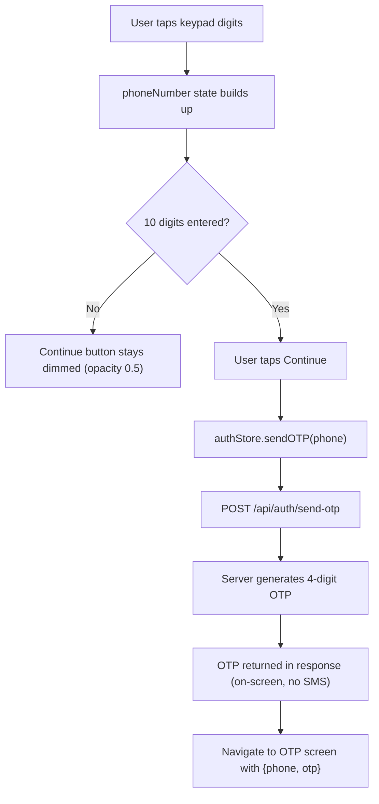

# ✅ Screen 3 Report: Login — Phone Entry

## What Was Built

**Mock source:** [code13.html](file:///c:/Users/renan/OneDrive/Desktop/edhigo_pani/code13.html)
**Implementation:** [LoginScreen.js](file:///c:/Users/renan/OneDrive/Desktop/edhigo_pani/mobile/src/screens/auth/LoginScreen.js)

## How the Logic Works



### Key Logic Details:

| Feature | How it works |
|---------|-------------|
| **Custom keypad** | 3×4 grid: digits 1-9, empty cell, 0, backspace. No system keyboard used. |
| **Phone formatting** | Live formatting: `9876` → `9876 5` → `9876 543210` (4+6 split) |
| **Backspace** | Tap removes last digit. **Long-press clears entire number.** |
| **10-digit limit** | `handleKeyPress` ignores input after 10 digits |
| **Continue button** | Disabled (dimmed) until exactly 10 digits entered |
| **Backend call** | `POST /api/auth/send-otp { phone }` → returns `{ otp, expiresIn, userId }` |
| **On-screen OTP** | OTP is passed via navigation params to the OTP screen — zero SMS cost |
| **Error handling** | Alert shown if API fails with the server's error message |
| **Loading state** | Spinner replaces button text while API call is in progress |

### UI Components (from code13.html):

| Element | Implementation | Mock CSS |
|---------|---------------|----------|
| **Voice bar** | Bordered card with Telugu text + 56px speaker button | `rounded-xl border border-[#dfe6db] p-5 shadow-sm` |
| **Phone label** | phone_iphone icon + "PHONE NUMBER" tracking text | `tracking-widest text-xs uppercase` |
| **Phone display** | 40px bold read-only number with primary underline | `text-4xl font-bold border-b-2 border-primary/30 tracking-widest` |
| **Keypad buttons** | 80px tall, rounded-2xl, bordered, shadow-sm | `h-20 rounded-2xl border border-[#dfe6db] text-3xl font-bold` |
| **Backspace** | Red icon, red highlight on active | `text-red-500 active:bg-red-50` |
| **Continue** | Full-width pill, primary bg, shadow-xl | `rounded-full bg-primary h-16 text-xl font-bold shadow-xl` |

### Backend Endpoint Used:
```
POST /api/auth/send-otp
Body: { "phone": "9876543210" }
Response: { "message": "OTP generated", "otp": "1234", "expiresIn": 300, "userId": "uuid" }
```

## Next Up: Screen 4 — OTP Verification
