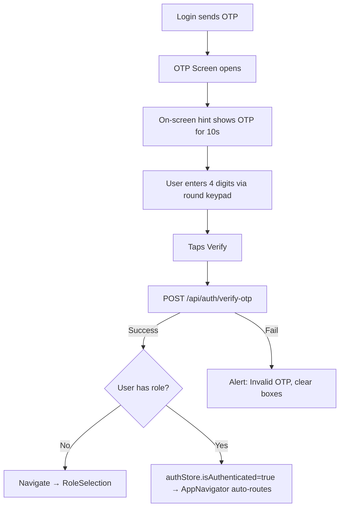

# ✅ Screen 4 Report: OTP Verification

**Mock source:** [code15.html](file:///c:/Users/renan/OneDrive/Desktop/edhigo_pani/code15.html)
**Implementation:** [OTPScreen.js](file:///c:/Users/renan/OneDrive/Desktop/edhigo_pani/mobile/src/screens/auth/OTPScreen.js)

## How the Logic Works



### Key Logic Details:

| Feature | How it works |
|---------|-------------|
| **On-screen OTP** | Received from login screen via `route.params.otp`. Shown in green hint bar, auto-hides after 10 seconds. |
| **4 input boxes** | Array state `['','','','']`. Fill tracking: `currentIndex = first empty slot`. |
| **Box states** | Empty = gray border. **Filled** = 4px primary border + shadow. **Active** = 3px primary + subtle bg. |
| **Round keypad** | Circular buttons (`aspect-square rounded-full`). Responsive size via `Dimensions`. |
| **Backspace** | Pink background (`#ffebeb`). Long-press clears all 4 boxes. |
| **Verify** | Joins digits → `POST /api/auth/verify-otp` → JWT tokens saved to Zustand. |
| **Post-verify routing** | No role → `RoleSelection`. Has role → `isAuthenticated=true` triggers AppNavigator. |
| **Resend** | Calls `sendOTP()` again, shows new OTP in Alert, resets hint timer. |

### Backend Endpoint:
```
POST /api/auth/verify-otp
Body: { "phone": "9876543210", "otp": "1234" }
Response: { "user": {...}, "accessToken": "jwt...", "refreshToken": "jwt..." }
```

## Next Up: Screen 5 — Role Selection
