# ✅ Screen 5 Report: Role Selection

**Mock source:** [code25.html](file:///c:/Users/renan/OneDrive/Desktop/edhigo_pani/code25.html)
**Implementation:** [RoleSelectionScreen.js](file:///c:/Users/renan/OneDrive/Desktop/edhigo_pani/mobile/src/screens/auth/RoleSelectionScreen.js)

## How the Logic Works

```mermaid
flowchart TD
    A["OTP Verified → No role set"] --> B["RoleSelection Screen"]
    B --> C["User taps a role card"]
    C --> D["POST /api/auth/set-role"]
    D -->|farmer| E["authStore.user.role = 'farmer'"]
    D -->|worker| F["authStore.user.role = 'worker'"]
    D -->|leader| G["authStore.user.role = 'leader'"]
    E --> H["AppNavigator detects role → auto-routes to FarmerHome"]
    F --> I["AppNavigator detects role → auto-routes to WorkerHome"]
    G --> J["AppNavigator detects role → auto-routes to LeaderHome"]
```



### UI Components (from code25.html):

| Element | Implementation | Mock CSS |
|---------|---------------|----------|
| **Top bar** | Voice speaker (56px primary circle) + "Role Selection" + Help icon | `sticky top-0 shadow-sm` |
| **Headline** | "Meeru evaru?" (Telugu) + "Who are you?" | `text-[36px] font-bold text-center` |
| **Role cards** | 3 white cards with shadow, 2px transparent border → primary on active | `rounded-xl shadow-[0_4px_12px] border-2 active:border-primary` |
| **Icon circles** | 96×96 round with 10% primary bg (30% on selected) | `w-24 h-24 rounded-full bg-primary/10` |
| **Icons** | `agriculture` / `handyman` / `groups` at 48px | Material Symbols `icon-large` |
| **Select pill** | Primary bg, 32px horizontal padding | `bg-primary px-8 py-2 rounded-full` |

### Backend Endpoint:
```
POST /api/auth/set-role  (requires JWT)
Body: { "role": "farmer" | "worker" | "leader" }
Response: { "user": { id, phone, name, role, language } }
```

---

## 🎉 Phase 1: Onboarding — COMPLETE!

All 5 onboarding screens are built and connected:

| # | Screen | Mock | Backend |
|---|--------|------|---------|
| 1 | Splash | code26.html | None |
| 2 | Language | code10.html | Local store |
| 3 | Login | code13.html | `POST /auth/send-otp` |
| 4 | OTP | code15.html | `POST /auth/verify-otp` |
| 5 | Role Selection | code25.html | `POST /auth/set-role` |

## Next Up: Phase 2 — Screen 6: Farmer Home (Work Type Grid)
