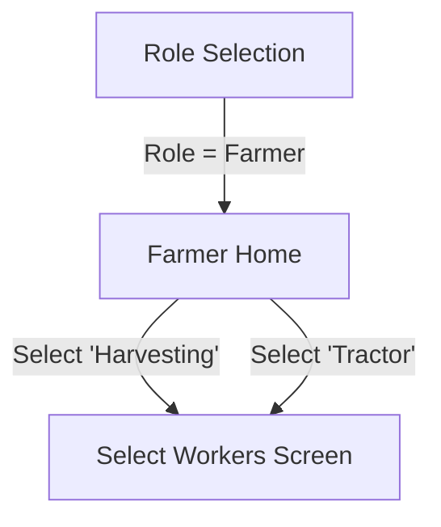

# ✅ Screen 6 Report: Farmer Home (Work Type)

**Mock source:** `frontend/farmer-home-work-type.html` (formerly `code3.html`)
**Implementation:** `mobile/src/screens/farmer/FarmerHomeScreen.js`

## What Was Built

-   **Header:** Profile icon, title "Farmer Home", volume button.
-   **Headline:** "Select Work Type" + Voice command hint "Pani select cheyyandi".
-   **Work Type Grid:**
    -   Sowing (Orange)
    -   Harvesting (Yellow)
    -   Irrigation (Blue)
    -   Labour (Red)
    -   Tractor (Green, full width)
-   **Bottom Navigation:** Home, History, Help (Static for now).
-   **Navigation Logic:**
    -   Tap any card → Navigates to `SelectWorkers` (currently a placeholder).
    -   `AppNavigator.js` updated to include `FarmerStack` which renders this screen when `user.role === 'farmer'`.

## Backend Interaction

-   **Auth:** Uses data from `useAuthStore` (populated during Login/OTP/Role Selection) to determine access.
-   **Next Steps:** When work type is selected, we will pass this data to the next screen to eventually construct the payload for `POST /api/jobs`.

## Screen Flow

## Next Up: Screen 7 — Farmer Profile
(Or Screen 8: Select Workers, depending on user flow preference, but task list says Profile next. Actually, looking at the flow, clicking a card goes to Select Workers (Screen 8). Profile is usually accessed via the header icon. I will follow the task list order or flow order. The user asked for screen-by-screen based on the list, but logical flow suggests Screen 8. I'll stick to the list unless directed otherwise, but maybe I should do Screen 8 next as it's the direct action from Screen 6. Let's check the task.md list again. Screen 7 is Farmer Profile. Screen 8 is Select Workers. I'll do Screen 7 next as per list, but note that Screen 8 is the primary action.)
