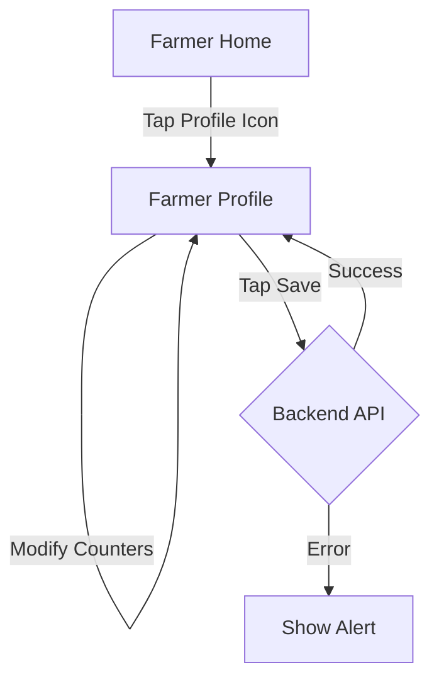

# ✅ Screen 7 Report: Farmer Profile

**Mock source:** `frontend/farmer-profile.html` (formerly `code4.html`)
**Implementation:** `mobile/src/screens/farmer/FarmerProfileScreen.js`

## What Was Built

-   **Header:** Back arrow (navigation), title "FARMER PROFILE".
-   **Profile Pic:** Large avatar with "Add Photo" badge (UI only for now).
-   **Voice Guidance:** "Meeru vyavasayam details ivvandi" (Please provide farming details).
-   **Land Section:**
    -   Counter for Land Size (n Acres).
    -   Large +/- buttons for easy interaction.
-   **Animals Section:**
    -   List: Cow, Buffalo, Goat.
    -   Individual counters for each animal.
-   **Save Button:** Large floating/sticky bottom button to Save Details.
-   **Backend Integration:**
    -   **Added:** `updateProfile` method in `auth.controller.js`.
    -   **Added:** `PUT /api/auth/profile` route.
    -   **Logic:** Updates `landAcres` and `animals` JSON in the `User` model.
    -   **State:** Updates local Zustand store on success.

## Screen Flow

## Next Up: Screen 8 — Select Workers
(This is the screen users see after selecting a work type like "Harvesting" on the Home screen).
