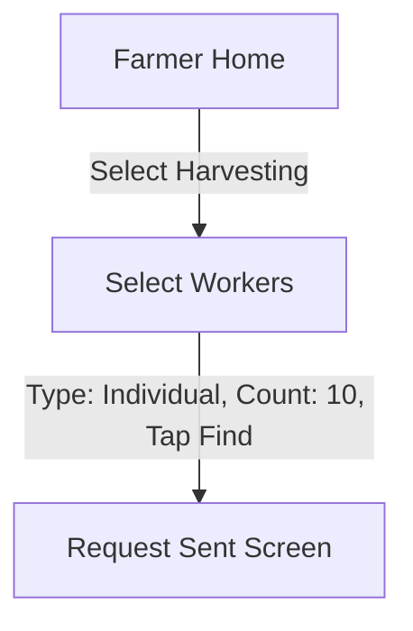

# ✅ Screen 8 Report: Select Workers

**Mock source:** `frontend/worker-type-count.html` (formerly `code32.html`)
**Implementation:** `mobile/src/screens/farmer/SelectWorkersScreen.js`

## What Was Built

-   **Two-Pane Selection:** Big toggle cards for "Individual" vs "Group".
-   **Interactive Stepper:**
    -   Double-digit input field.
    -   Large +/- buttons.
-   **Quick Chips:** Preset counts (5, 10, 20, 50).
-   **Bottom Action:** "Find Workers" button.
-   **Navigation:**
    -   Receives `workType` (e.g., Harvesting) from Screen 6.
    -   Passes `{ workType, workerType, count }` to Screen 9 (`RequestSent`).

## Screen Flow

## Backend Interaction
-   This screen is primarily for **State Collection**. No direct API call happens *on this screen*.
-   The API call (`POST /api/jobs`) will likely happen on the transition to Screen 9 or immediately upon mounting Screen 9.

## Next Up: Screen 9 — Request Sent
(The radar animation screen showing the system searching for workers).
