# 📘 FarmConnect — System Design Document (SDD)

> **Version:** 1.0
> **Status:** In Development
> **Role:** Master Technical Reference

---

## 1. 🏗️ High-Level Architecture

FarmConnect follows a **Monolithic client-server architecture** optimized for real-time interaction and offline-first mobile usage.

### System Context Diagram

```mermaid
graph TD
    User((User))
    Admin((Admin))
    
    subgraph Client["📱 Mobile App (Expo/React Native)"]
        UI[UI Components]
        Store[Zustand Store]
        Cache[AsyncStorage]
        SocketC[Socket.io Client]
    end
    
    subgraph Server["☁️ Backend (Node/Express)"]
        API[REST API]
        SocketS[Socket.io Server]
        Auth[JWT Auth Service]
        Logic[Business Logic]
    end
    
    subgraph Data["💾 Data Layer"]
        DB[(PostgreSQL)]
        Redis[(Redis Cache)]
        Blob[Object Storage]
    end

    User -->|Interacts| UI
    UI -->|State Updates| Store
    Store -->|HTTP Requests| API
    Store -->|Real-time Events| SocketS
    API -->|Read/Write| DB
    SocketS -->|Pub/Sub| Redis
```

---

## 2. 📱 Frontend Design (Mobile)

### Technology Stack
-   **Framework:** React Native (Expo SDK 50+)
-   **Navigation:** React Navigation (Native Stack)
-   **State Management:** Zustand (Global State) + React Query (Server State)
-   **Styling:** NativeWind (TailwindCSS for RN)
-   **Maps:** react-native-maps
-   **Offline:** AsyncStorage + NetInfo

### Navigation Structure

---

## 3. ⚙️ Backend Design (API)

### Technology Stack
-   **Runtime:** Node.js
-   **Framework:** Express.js
-   **Database ORM:** Prisma
-   **Real-time:** Socket.io
-   **Auth:** JWT (Access + Refresh Tokens)
-   **Validation:** Joi / Zod

### Core API Endpoints

| Module | Method | Endpoint | Description |
|:---|:---|:---|:---|
| **Auth** | `POST` | `/auth/send-otp` | Generate login OTP |
| | `POST` | `/auth/verify-otp` | Verify OTP & issue JWT |
| | `POST` | `/auth/set-role` | Set user role (Farmer/Worker) |
| | `PUT` | `/auth/profile` | Update profile fields |
| **Jobs** | `POST` | `/jobs` | Create a new job offer |
| | `GET` | `/jobs/nearby` | Find jobs within radius |
| | `POST` | `/jobs/:id/apply` | Worker accepts a job |
| **Groups** | `POST` | `/groups` | Create a new labour group |
| | `POST` | `/groups/:id/join` | Join a group via QR |
| **Attend** | `POST` | `/attendance/generate` | Generate In/Out QR |
| | `POST` | `/attendance/scan` | Verify QR & log time |

---

## 4. 💾 Database Schema (ERD)

The database is normalized to 3NF. Key entities are Users, Jobs, and Groups.

---

## 5. 🔄 Real-Time Event System

Socket.io is used for features requiring <500ms latency.

### Event Names & Payloads
1.  **`start_tracking`** `(client -> server)`
    -   Payload: `{ lat: 17.385, lng: 78.486 }`
    -   Action: Updates Redis geo-spatial index.
2.  **`iob:new_offer`** `(server -> client)`
    -   Payload: `{ jobId, type, pay, distance }`
    -   Target: Workers within 5km radius.
3.  **`job:accepted`** `(server -> client)`
    -   Payload: `{ workerId, name, eta }`
    -   Target: Job poster (Farmer).
4.  **`attendance:success`** `(server -> client)`
    -   Payload: `{ checkInTime, status: 'verified' }`
    -   Target: Both Farmer and Worker screens.

---

## 6. 🔒 Security & Performance

### Security
-   **Auth:** Phone-based OTP (no passwords).
-   **Session:** Short-lived Access Token (15m) + HttpOnly Refresh Token (7d).
-   **Data:** Inputs sanitized via Prisma (prevents SQLi).
-   **Privacy:** Location data only shared during active "Online" status.

### Performance
-   **Geo-hashing:** PostGIS / Redis Geo for O(1) nearby worker lookups.
-   **Optimistic UI:** Local state updates immediately, syncs in background.
-   **Image Optimization:** Cloudinary/S3 for resizing profile logs.

---

## 7. 🎨 Design Principles (UI/UX)
-   **Voice First:** All primary actions have voice guidance (Tel/Hin/Eng).
-   **High Affordance:** Large touch targets (min 48px), distinct colors.
-   **Visual Feedback:** Sound + Vibration on success (e.g., QR Scan).
-   **Offline Tolerant:** Core flows (viewing history, profile) work without net.
